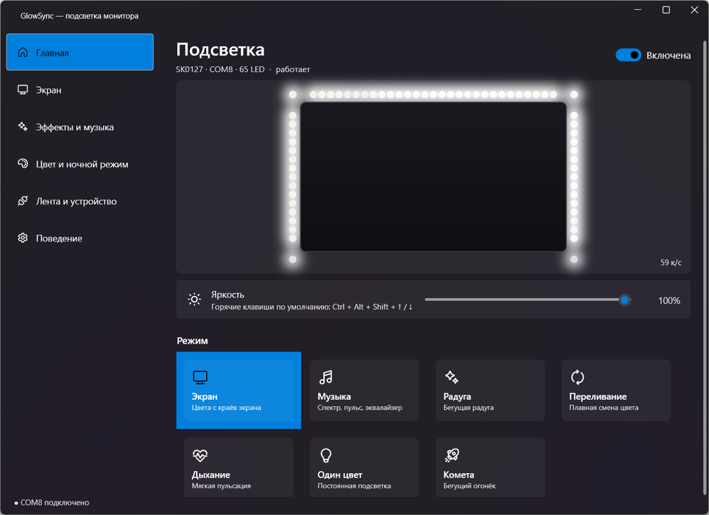

# GlowSync

Подсветка монитора для Windows: лента повторяет цвета с краёв экрана, пляшет под музыку или светит эффектами.
Замена родной программы Skydimo — живёт в трее, окно само никогда не открывается, гаснет вместе с монитором.

> **English:** Windows ambient-light app for Skydimo/Adalight LED strips (screen sync, music, effects).
> Tray-only, turns the strip off with the monitor, imports an existing Skydimo setup. UI is in Russian.



## Возможности

- **Синхронизация с экраном** — DXGI Desktop Duplication, кадр уменьшается на видеокарте, нагрузка на процессор ~0,1 %.
  Настройки: частота 10–60 кадров/с, плавность, насыщенность, гамма, глубина захвата, смешивание соседних
  светодиодов, порог чёрного, автоудаление чёрных полос у широкоформатных фильмов (субтитры в полосе не сбивают).
- **Музыка** — звук берётся с устройства воспроизведения (WASAPI loopback, микрофон не нужен):
  спектр, пульс, VU-метр. Переключение наушники/колонки подхватывается само.
- **Эффекты** — радуга, переливание, дыхание, один цвет, комета.
- **Гаснет вместе с монитором** — двумя независимыми способами, потому что одного мало:
  1. сигналы Windows о состоянии экрана (console display state, session display status, monitor power);
  2. опрос самого монитора по DDC/CI (VCP 0xD6) раз в 2 секунды — ловит выключение кнопкой монитора,
     о котором Windows не сообщает вообще.

  Монитор, который не отвечает на DDC/CI, никогда не погасит ленту сам по себе, одиночный пропущенный
  ответ — тоже (нужно три подряд). Выключение применяется, если экран погашен дольше 2 секунд, включение —
  сразу: это спасает от мониторов, которые при засыпании десяток раз моргают вкл/выкл. Лента гаснет также
  при сне и выключении компьютера, по желанию — при блокировке (Win + L).
- **Ночной режим** — ограничение яркости по расписанию. **Баланс белого** R/G/B, если лента уходит в синеву.
- **Глобальные горячие клавиши** с настройкой и ненавязчивой подсказкой на экране, которая не забирает фокус у игр.
- **Автопоиск и автопереподключение** ленты: выдернули USB, компьютер поспал, порт занят другой программой —
  подключится само, без перезапуска. Bluetooth-порты не опрашиваются (их опрос вешает систему на секунды).
- **Редактор раскладки** (сколько светодиодов на каждой стороне, начало, направление, сдвиг) и тест сторон.
- **Импорт настроек Skydimo** одной кнопкой: яркость, режим, раскладка, частота, горячие клавиши.
- Лог ограничен 1 МБ (у Skydimo логи разрастались до 15 ГБ).

## Что нужно

- Windows 10 (1903+) или Windows 11.
- [.NET 8 Desktop Runtime](https://dotnet.microsoft.com/download/dotnet/8.0) — если его нет, Windows предложит
  скачать при первом запуске.
- Лента с контроллером Skydimo (проверено на **SK0127**, 65 светодиодов, USB-чип CH340) — или любая
  самодельная лента с прошивкой **Adalight** (Arduino, ESP и подобные).

## Установка

**Готовый exe:** скачайте `GlowSync.exe` со страницы [Releases](../../releases), положите в любую папку и запустите.
Программа поставит себя в автозапуск (тихо, в трей) и сама найдёт ленту на USB-порту.

**Из исходников:**

```powershell
git clone https://github.com/skybots-tg/glowsync.git
cd glowsync
.\install.ps1
```

`install.ps1` собирает проект, ставит его в `%LOCALAPPDATA%\Programs\GlowSync`, создаёт ярлык в меню «Пуск»
и запускает. Этой же командой обновляется уже установленная копия.

Аргументы запуска: `--autostart` — тихий старт в трей (так прописан автозапуск), `--exit` — закрыть работающий экземпляр.

Файлы программы: настройки `%LOCALAPPDATA%\GlowSync\config.json`, лог `%LOCALAPPDATA%\GlowSync\logs`.

## Горячие клавиши по умолчанию

| Действие | Сочетание |
|---|---|
| Включить / выключить подсветку | Ctrl + Alt + Shift + F10 |
| Ярче / темнее | Ctrl + Alt + Shift + ↑ / ↓ |
| Следующий / предыдущий режим | Ctrl + Alt + Shift + → / ← |

Меняются в настройках, на вкладке «Поведение».

## Если что-то не так

| Симптом | Причина и что делать |
|---|---|
| «Порт COM занят другой программой» | Запущен Skydimo или другой софт для ленты. В настройках → «Поведение» есть кнопка «Закрыть Skydimo и убрать из автозапуска» (с возможностью вернуть). |
| Лента не гаснет с монитором | Проверьте на вкладке «Поведение», что монитор отвечает по DDC/CI. Если написано «монитор пока не отвечал» — включите DDC/CI в меню самого монитора. |
| Устройство не найдено | Нужен драйвер USB-чипа (для Skydimo — CH340). Проверьте, что лента видна в диспетчере устройств как COM-порт. |
| Цвета не на своих местах | Вкладка «Лента и устройство» → «Тест сторон»: слева красный, сверху зелёный, справа синий, снизу жёлтый, первый светодиод белый. Поправьте начало и направление. |
| Тёмные сцены в фильме мерцают | Увеличьте «Порог чёрного» и «Плавность» на вкладке «Экран». |
| Чёрный экран на видео из браузера | Защищённый контент (Netflix и подобные) не попадает в захват экрана — это ограничение Windows, не программы. |

## Протокол Skydimo

Пригодится, если пишете своё: контроллеры Skydimo — это Adalight с другим заголовком кадра.

- Порт: 115200 бод, 8N1.
- Рукопожатие: отправить `Moni-A`, в ответ придёт `SK0127,` + 7 байт серийного номера + `\r\n`
  (среди этих байтов бывают 0x0D и 0x0A, так что разбирать построчно нельзя).
- Кадр: `'A' 'd' 'a' 0x00 <count_hi> <count_lo>` и дальше `count × RGB`, по 3 байта на светодиод.
  У классического Adalight иначе: `'A' 'd' 'a'` + `(count-1)` + контрольный байт `hi ^ lo ^ 0x55`.
- Контроллер ждёт ровно столько светодиодов, сколько указано для его модели (у SK0127 — 65).
- Зоны захвата: экран делится на сетку (у SK0127 — 31×17), каждый светодиод берёт среднее по своей клетке;
  к результату применяется гамма 2.2. Так получается картинка, неотличимая от родной программы
  (сверено с реальным выводом Skydimo: расхождение ≤ 2 из 255).

## Разработка

```powershell
dotnet build GlowSync.sln
dotnet build tests -o $env:TEMP\gs-tests; & $env:TEMP\gs-tests\GlowSync.Tests.exe
```

Тесты проверяют генератор раскладки (сверяется с картами Skydimo, если он установлен), разбор ответа
контроллера, импорт настроек, сэмплер зон (против эталонного вывода Skydimo на градиенте), определение
чёрных полос, ночное расписание, логику опроса монитора и настоящий захват экрана через видеокарту.

Две грабли, на которые стоит обратить внимание, если делаете похожее:

- **Vortice 3.8**: обёртка `IDXGIOutput5.DuplicateOutput1` рушит процесс с AccessViolation, поэтому метод
  вызывается напрямую через vtable (см. `DesktopCapture.DuplicateOutput1`).
- **`POWERBROADCAST_SETTING`** несёт ровно один байт данных после GUID и длины. Если читать его как
  32-битное значение, в старшие байты попадает мусор из-за буфера, и «экран выключен» превращается
  в «включён» (см. `SystemEvents.OnPowerSettingChange`).
- **`System.IO.Ports`** намеренно не используется: его фоновый поток роняет процесс, если USB-адаптер
  выдернуть при открытом порте. Вместо него — тонкая обёртка над `CreateFile`/`WriteFile`.

## Лицензия

MIT — делайте что хотите, автор ничего не гарантирует.
